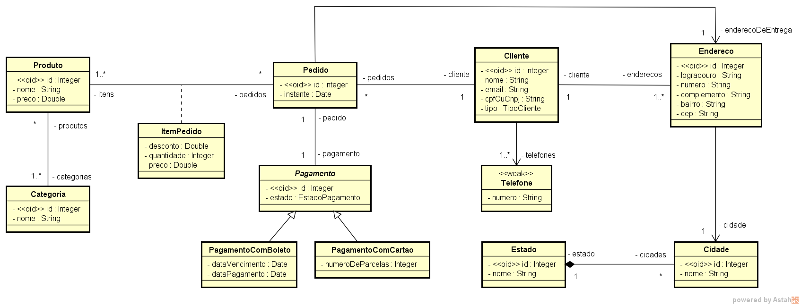

# APP Sistema de Pedidos 
[](https://github.com/mrraxa01/app_springionic/blob/main/LICENSE) 

#Sobre o APP:
App desenvolvido durante o curso Spring-boot Ionic do professor Nélio Alves - Disponível na Udemy no link: https://www.udemy.com/course/spring-boot-ionic/.

 -> Abordagens do curso:
  - Implementação de modelos de domínio
  - Acesso a dados com Spring Data
  - Criação de API Rest com serialização JSON
  - Autenticação e autorização com token
  - Armazenamento de imagens Amazon S3
  - Mapeamento objeto-relacional JPA
  - Desenvolvimento em camadas
  - Desenvolvimento baseado em casos de uso
  - Envio de emails
  - Implantação do backend no Heroku
  - Criação de aplicação multiplataforma com IONIC
  

# Modelo Conceitual 




```
# Autor
**Márcio Rodrigues Rezende**
mrraxa01@gmail.com
